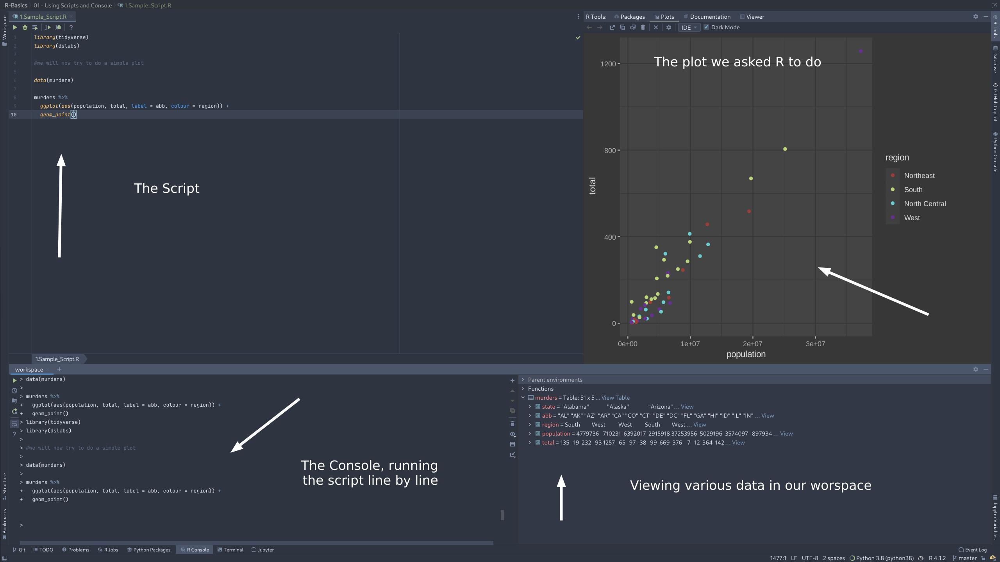
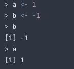
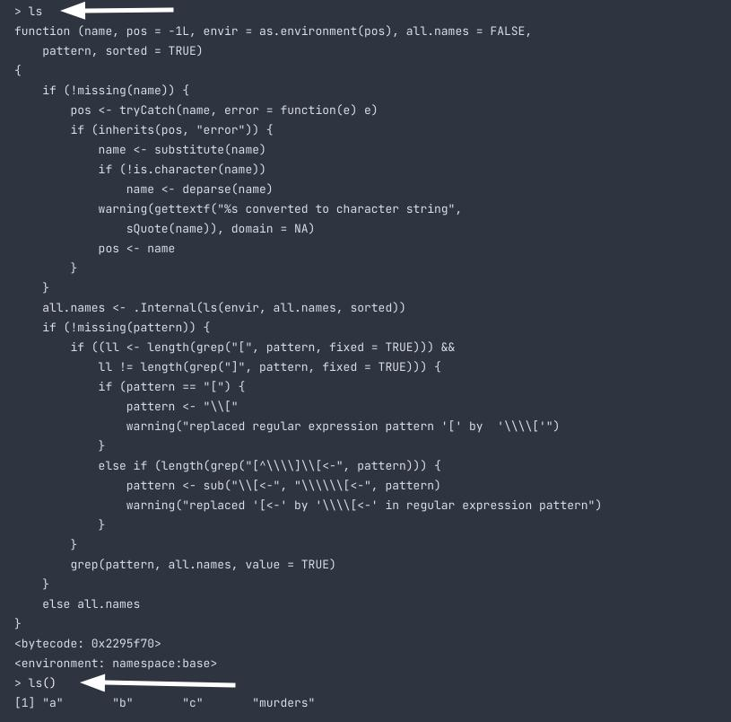

# Starting with R

## R in DataSpell



When you run a script, the IDE will run the script line by line on the console. If it has some graphics, the IDE will display them. Along with it, you get a pane, where you can browse the workspace's variables and stuff.

## Assigning something to a variable

```R
a <- 1
b <- -1

# Here, we just assigned a to be 1, and b to be -1.
```

We can also use = to assign a value to a variable, but its recommended not to use it.



Example of solving the quadratic formula in R


## Functions

Earlier we used `sqrt()` which is a function. Functions are either built in, brought in from libraries, or defined by the user.

If you dont use `()` it instead prints the code for the function, rather than using the function.




Most functions require atleat 1 arguments. You can see the same in here [Sample_Script](./1.Sample_Script.R)

## Data types in R

Function `class()` helps us to find the data type of some object.

```R
> a <- 1
> class(a)

[1] "numeric"

```

## Using a data set

Note - We will be using dslabs to get our data set.

```R
> library(dslabs)
> data(murders)
# Now we will check class of this data set
> class("murders")

[1] "data.frame"
```

### str() function

We use `str()` to find the structure of a dateframe.

```R
> str(murders)

'data.frame':	51 obs. of  5 variables:
 $ state     : chr  "Alabama" "Alaska" "Arizona" "Arkansas" ...
 $ abb       : chr  "AL" "AK" "AZ" "AR" ...
 $ region    : Factor w/ 4 levels "Northeast","South",..: 2 4 4 2 4 4 1 2 2 2 ...
 $ population: num  4779736 710231 6392017 2915918 37253956 ...
 $ total     : num  135 19 232 93 1257 ...
 

 #The first line says that this is a dataframe with 51 observations and 5 features.
 # The following lines preview few elements of that feature along with its data type
 ```

 If you notice, the region has the data type `Factor`. This is used to store categorical data. Like 1 maps to 'A', 2 maps to 'B' and so on. This is mostly because of memory management. It dosent matter for small data sets like this. But when it comes to larger data sets, it counts

 ### Accessing the data inside a dataframe

 To access a column, we use `$` followed by the column name.

 For example

 ```R
> data(murders)

> str(murders)

'data.frame':	51 obs. of  5 variables:
 $ state     : chr  "Alabama" "Alaska" "Arizona" "Arkansas" ...
 $ abb       : chr  "AL" "AK" "AZ" "AR" ...
 $ region    : Factor w/ 4 levels "Northeast","South",..: 2 4 4 2 4 4 1 2 2 2 ...
 $ population: num  4779736 710231 6392017 2915918 37253956 ...
 $ total     : num  135 19 232 93 1257 ...

> murders$population

[1]  4779736   710231  6392017  2915918 37253956  5029196  3574097   897934   601723 19687653  9920000  1360301  1567582 12830632  6483802  3046355
[17]  2853118  4339367  4533372  1328361  5773552  6547629  9883640  5303925  2967297  5988927   989415  1826341  2700551  1316470  8791894  2059179
[33] 19378102  9535483   672591 11536504  3751351  3831074 12702379  1052567  4625364   814180  6346105 25145561  2763885   625741  8001024  6724540
[49]  1852994  5686986   563626
```

### Using names function to get features in a data set (It returns the names of the columns)

```R
> names(murders)
[1] "state"      "abb"        "region"     "population" "total"
```


### Creating a Data Frame

You can create a data frame using the data.frame function. Here is a quick example:

```R
temp <- c(35, 88, 42, 84, 81, 30)
city <- c("Beijing", "Lagos", "Paris", "Rio de Janeiro", "San Juan", "Toronto")
city_temps <- data.frame(name = city, temperature = temp)

```

## Bunch of code for you to try out

```R
# loading the dslabs package and the murders dataset
library(dslabs)
data(murders)

# determining that the murders dataset is of the "data frame" class
class(murders)
# finding out more about the structure of the object
str(murders)
# showing the first 6 lines of the dataset
head(murders)

# using the accessor operator to obtain the population column
murders$population
# displaying the variable names in the murders dataset
names(murders)
# determining how many entries are in a vector
pop <- murders$population
length(pop)
# vectors can be of class numeric and character
class(pop)
class(murders$state)

# logical vectors are either TRUE or FALSE
z <- 3 == 2
z
class(z)

# factors are another type of class
class(murders$region)
# obtaining the levels of a factor
levels(murders$region)
```