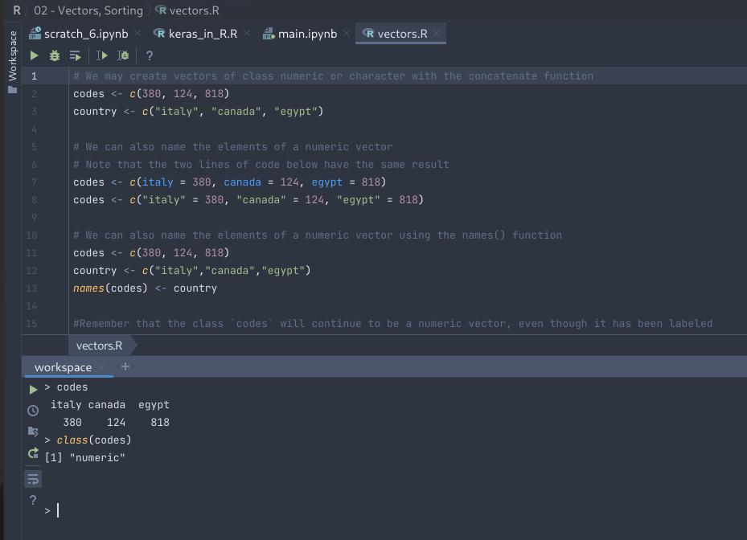
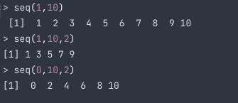
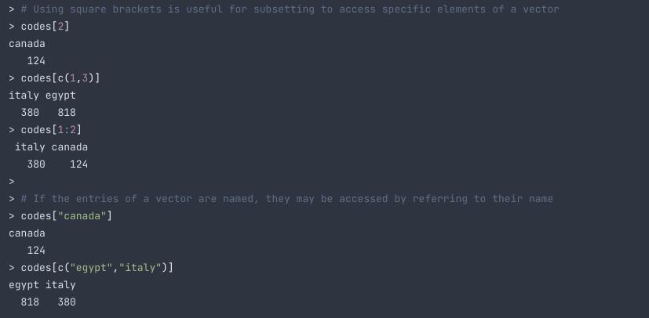

# Vectors

Vectors is the basic unit in R.

## Creating Vectors

One way to create vectors is to use the `c` function.

```R

# We may create vectors of class numeric or character with the concatenate function
codes <- c(380, 124, 818)
country <- c("italy", "canada", "egypt")

# We can also name the elements of a numeric vector
# Note that the two lines of code below have the same result
codes <- c(italy = 380, canada = 124, egypt = 818)
codes <- c("italy" = 380, "canada" = 124, "egypt" = 818)

# We can also name the elements of a numeric vector using the names() function
codes <- c(380, 124, 818)
country <- c("italy","canada","egypt")
names(codes) <- country

#Remember that the class `codes` will continue to be a numeric vector, even though it has been labeled

```



## Creating Sequences

We use `seq()` to generate number sequences.

The syntax is:
`seq(start, stop, step)`

`start`: the first number in the sequence
`stop`: the last number in the sequence
`step`: the step size between numbers in the sequence

Note: If you want consecutive numbers, use can use this shortcut `1:10` --> `start:stop`



## Accessing Elements in a Vector

We use [] to access stuff in vectors

```R
# Using square brackets is useful for subsetting to access specific elements of a vector
codes[2]
codes[c(1,3)]
codes[1:2]

# If the entries of a vector are named, they may be accessed by referring to their name
codes["canada"]
codes[c("egypt","italy")]
```

