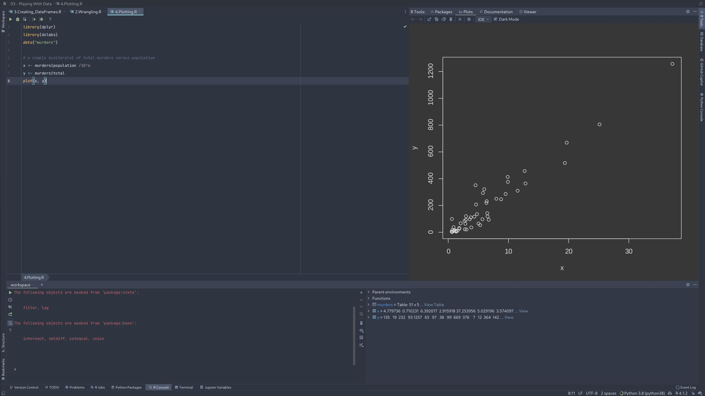
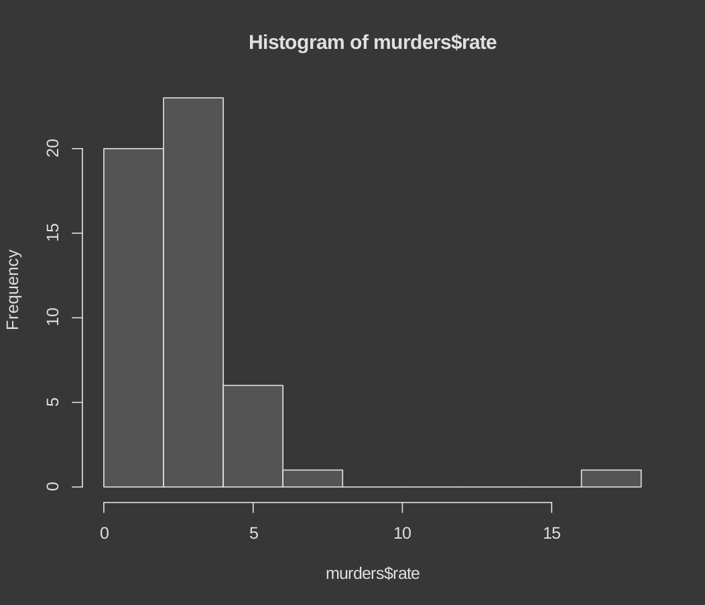
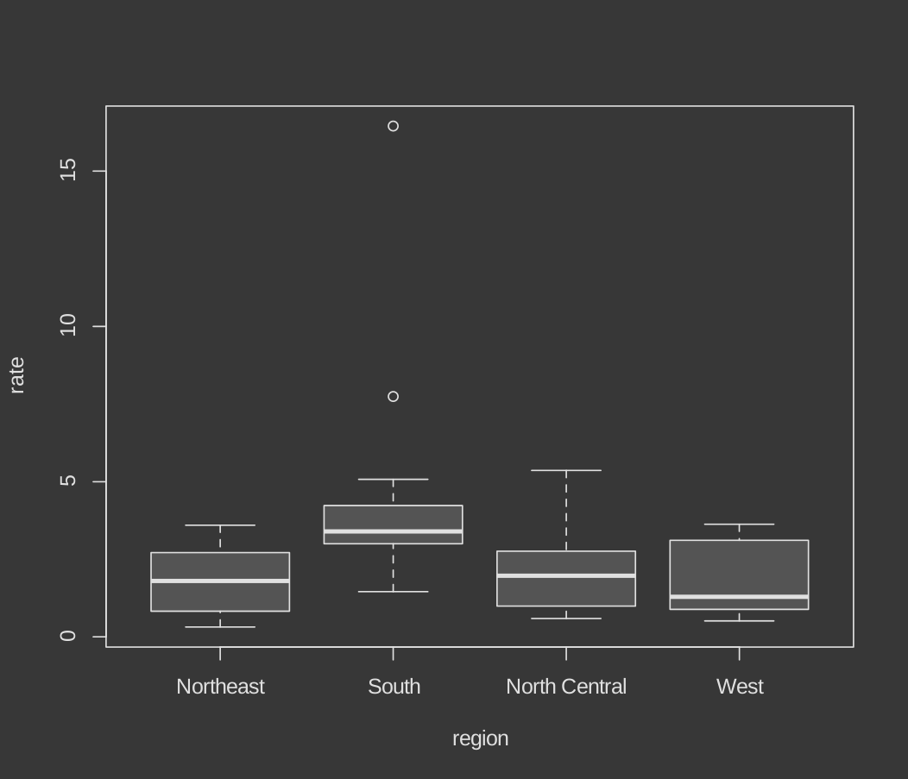

# Indexing in R

R has powerful tools to perform indexing.

We will see an example, on how easy it is to filter out states with certain thresholds of murder rate.

Note: In R, vectors can be indexed with logicals. This means, when an index says 'TRUE' the vector is indexed. We will be using this in the upcomming example

```R
# defining murder rate as before
murder_rate <- murders$total / murders$population * 100000

# creating a logical vector that specifies if the murder rate in that state is less than or equal to 0.71
index <- murder_rate <= 0.71

# determining which states have murder rates less than or equal to 0.71
murders$state[index]

# calculating how many states have a murder rate less than or equal to 0.71
sum(index)
```

## Some functions in indexing

We will look at 3 functions used in indexing. They are `which`, `match`, and `%in%`.

`which()` gives returns a vector, with the index value of TRUE in the input vector.

```R
x <- c(FALSE, TRUE, FALSE, TRUE, TRUE, FALSE)
which(x)    # returns indices that are TRUE

[1] 2 4 5
```

`match()` looks for entries in a vector and returns the index needed to access them.

```R
index <- match(c("New York", "Florida", "Texas"), murders$state)
index
murders$state[index]
murder_rate[index]

```

`%in%` function checks if one array is the subset of another array

# Data Wrangling

We will be using dplyer package here. Make sure to install them.

This packages provides some basic data manuplation functions, with easy to remember names

`mutate()` is used to add columns to our data set.

```R

murders <- mutate(murders, rate = total / population * 100000)

```

You can check first few rows of the data set by using `head()` function.

`filter()` is used to filter out data based on a condition.

```R
filter(murders, rate <= 0.71)
```

`select()` is used to select a subset of data based on column names.

```R
new_table <- select(murders, state, region, rate)

filter(new_table, rate <= 0.71)
```

## The pipe operator `%>%`

The `%>%` operator is used to chain together functions.

Lets see an example, where we are gonna filter out states with certain murder rate.

```R
murders %>% select(state, region, rate) %>% filter(rate <= 0.71)
```

# Creating Data Frames

Creating dataframes is straight forward in R. Look at the following example

```R
# creating a data frame with stringAsFactors = FALSE
grades <- data.frame(names = c("John", "Juan", "Jean", "Yao"), 
                     exam_1 = c(95, 80, 90, 85), 
                     exam_2 = c(90, 85, 85, 90),
                     stringsAsFactors = FALSE)
```

Formerly, the `data.frame()` function turned characters into factors by default. To avoid this, we could utilize the stringsAsFactors argument and set it equal to false. As of R 4.0, it is no longer necessary to include the stringsAsFactors argument, because R no longer turns characters into factors by default.

# Plotting

Plotting with the inbuilt function is straight forward in R. You just call the function and pass the data you want to plot.

Lets see an simple example.

```R
library(dplyr)
library(dslabs)
data("murders")

# a simple scatterplot of total murders versus population
x <- murders$population /10^6
y <- murders$total
plot(x, y)
```



Similary, we can plot histogram and box plots

```R
# a histogram of murder rates
murders <- mutate(murders, rate = total / population * 100000)
hist(murders$rate)

# boxplots of murder rates by region
boxplot(rate~region, data = murders)
```

Here is the histogram




Here is the box plot



