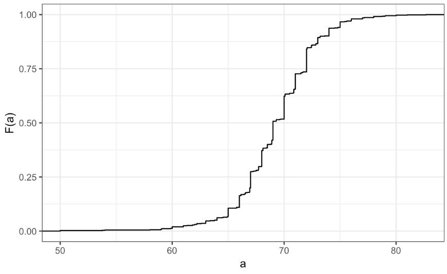
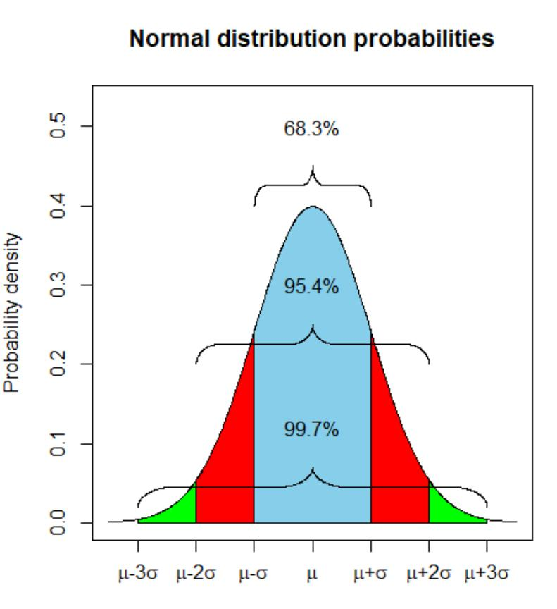

## Data types

There can be 2 main types of data, that we deal in visualizing:

Categorical data are variables that are defined by a small number of groups.

* Ordinal categorical data have an inherent order to the categories (mild/medium/hot, for example).
* Non-ordinal categorical data have no order to the categories.

Numerical data take a variety of numeric values.

* Continuous variables can take any value.
* Discrete variables are limited to sets of specific values.

## Distribution

A distribution is a function or description that shows the possible values of a variable and how often those values occur.

Lets try to use a dummy data, and try to see the ratio between 2 categories

```R
# load the dataset
library(dslabs)
data(heights)

# make a table of category proportions
prop.table(table(heights$sex))

#Output

   Female      Male 
0.2266667 0.7733333 
```

A frequency table is the simplest way to show a categorical distribution. Use `prop.table()` to convert a table of counts to a frequency table. Barplots display the distribution of categorical variables and are a way to visualize the information in frequency tables.

Frequency dist is good for categorical data, but when it comes to continous data, this becomes obselete. This is simply because usually all values are unique, and it dosent make sense to check frequency of a certain value.

Here, we use cummlative distribution function.

The cumulative distribution function (CDF) is a function that reports the proportion of data below a value 'a' for all values of 'a'.

Any continuous dataset has a CDF, not only normal distributions. For example, the male heights data we used in the previous section has this CDF:



But, this graph is particularly not intuvitive. So, we use histogram, which gives a lot more info, with a litte loss in data.

We will deal about histrogram later on.

A histogram divides data into non-overlapping bins of the same size and plots the counts of number of values that fall in that interval.

## Smooth density plots

Smooth density plots can be thought of as histograms where the bin width is extremely or infinitely small. The smoothing function makes estimates of the true continuous trend of the data given the available sample of data points.

The degree of smoothness can be controlled by an argument in the plotting function. (We will learn functions for plotting later.)

While the histogram is an assumption-free summary, the smooth density plot is shaped by assumptions and choices you make

The y-axis is scaled so that the area under the density curve sums to 1. This means that interpreting values on the y-axis is not straightforward. To determine the proportion of data in between two values, compute the area under the smooth density curve in the region between those values.

An advantage of smooth densities over histograms is that densities are easier to compare visually.

## Normal Distribution

Normal distributions are the most common type of distribution. They are characterized by a mean and a standard deviation.

They are known as gaussian distributions, and bell curve.

Rather than having the entire data, we can use a normal distribution to approximate the data.

Normal dist function is represented by a formula, which makes it easy to summarize the distribution.

The normal distribution:

* Is centered around one value, the mean
* Is symmetric around the mean
* Is defined completely by its mean and standard deviation
* Always has the same proportion of observations within a given distance of the mean

### Standard units

For data that are approximately normal, standard units describe the number of standard deviations an observation is from the mean. Standard units are denoted by the variable z  and are also known as z-scores.

### The 68-95-99.7 Rule

The normal distribution is associated with the 68-95-99.7 rule. This rule describes the probability of observing events within a certain number of standard deviations of the mean.





## The Normal CDF and pnorm

The normal distribution has a mathematically defined CDF which can be computed in R with the function pnorm().

pnorm(a, avg, s) gives the value of the cumulative distribution function F(a) for the normal distribution defined by average avg and standard deviation s.

We say that a random quantity is normally distributed with average avg and standard deviation s if the approximation pnorm(a, avg, s) holds for all values of a.

If we are willing to use the normal approximation for height, we can estimate the distribution simply from the mean and standard deviation of our values.

If we treat the height data as discrete rather than categorical, we see that the data are not very useful because integer values are more common than expected due to rounding. This is called discretization.

With rounded data, the normal approximation is particularly useful when computing probabilities of intervals of length 1 that include exactly one integer.


## Quantiles

Quantiles are cutoff points that divide a dataset into intervals with set probabilities. The q th quantile is the value at which q % of the observations are equal to or less than that value.

You can use the `quantile()` function to compute quantiles.

```R
#Given a dataset data and desired quantile q, you can find the qth quantile of data with:
quantile(data,q)
```

### Percentiles

Percentiles are the quantiles that divide a dataset into 100 intervals each with 1% probability. You can determine all percentiles of a dataset data like this:

```R
p <- seq(0.01, 0.99, 0.01)
quantile(data, p)
```

### Quartiles

Quartiles divide a dataset into 4 parts each with 25% probability. They are equal to the 25th, 50th and 75th percentiles. The 25th percentile is also known as the 1st quartile, the 50th percentile is also known as the median, and the 75th percentile is also known as the 3rd quartile.

The summary() function returns the minimum, quartiles and maximum of a vector.


### Examples

```R
library(dslabs)
data(heights)

#Use summary() on the heights$height variable to find the quartiles:

summary(heights$height)


#Find the percentiles of heights$height:

p <- seq(0.01, 0.99, 0.01)
percentiles <- quantile(heights$height, p)

#Confirm that the 25th and 75th percentiles match the 1st and 3rd quartiles. Note that quantile() returns a named vector. You can access the 25th and 75th percentiles like this (adapt the code for other percentile values):

percentiles[names(percentiles) == "25%"]
percentiles[names(percentiles) == "75%"]
```

## Finding quantiles with qnorm()

The qnorm() function gives the theoretical value of a quantile with probability p of observing a value equal to or less than that quantile value given a normal distribution with mean mu and standard deviation sigma:

```R
qnorm(p, mu, sigma)
```

By default, mu = 0 and sigma = 1. 


### Relation to pnorm

The pnorm() function gives the probability that a value from a standard normal distribution will be less than or equal to a z-score value z. Consider:

pnorm(-1.96) ~= 0.025

The result of pnorm() is the quantile. Note that:

qnorm(0.025) ~= -1.96

qnorm() and pnorm() are inverse functions:

pnorm(qnorm(0.025))  = 0.025


## Quantile-Quantile Plots

Quantile-quantile plots, or QQ-plots, are used to check whether distributions are well-approximated by a normal distribution.

We start by defining a series of proportion, for example, p equals 0.05, 0.10, 0.15, up to 0.95. Once this is defined for each p, we determine the value q, so that the proportion of the values in the data below q is p.

The q's are referred to as the quantiles.

Now we will apply this, to out male heights dataset.

[5.Q-Q plots](./5.Q-Q.R)

Here, you can see that our data points almost fit a straight line. This futher establishes the fact that our data is well suited as a normal distribution with certain parameters.

## Boxplots

When data do not follow a normal distribution and cannot be succinctly summarized by only the mean and standard deviation, an alternative is to report a five-number summary: range (ignoring outliers) and the quartiles (25th, 50th, 75th percentile).

In a boxplot, the box is defined by the 25th and 75th percentiles and the median is a horizontal line through the box. The whiskers show the range excluding outliers, and outliers are plotted separately as individual points.

The interquartile range is the distance between the 25th and 75th percentiles.

Boxplots are particularly useful when comparing multiple distributions.
