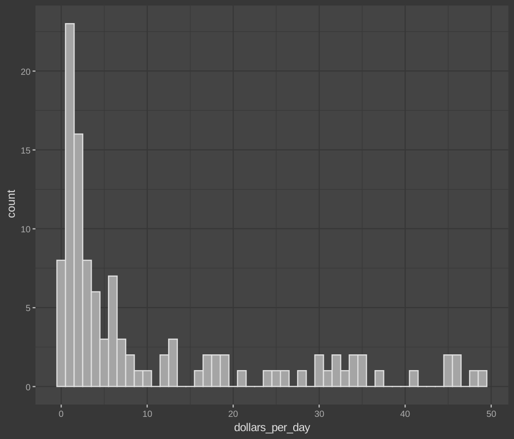

# Case Study: Trends in World Health and Economics

We will look at a case study involving data from the Gapminder Foundation about trends in world health and economics.

## The dataset

The gapmider dataset can be found here

```R
# load and inspect gapminder data
library(dslabs)
data(gapminder)
head(gapminder)
```

Now, we will explore new concepts, as we dig this data

## Faceting

Faceting makes multiple side-by-side plots stratified by some variable. This is a way to ease comparisons.

### `facet_grid()`

The facet_grid() function allows faceting by up to two variables, with rows faceted by one variable and columns faceted by the other variable. To facet by only one variable, use the dot operator as the other variable.

```R
# facet by continent and year
filter(gapminder, year %in% c(1962, 2012)) %>%
    ggplot(aes(fertility, life_expectancy, col = continent)) +
    geom_point() +
    facet_grid(continent ~ year)
```

What we just made is, a grid of plots (fertility vs life expectancy) for each continent, for each year.

You can take a look at ouptut for a better understanding.

Assume we want to compare just the overall trends in life expectancy, instad of making a grid of plots.

We use the `.` for it. Look at this example.

```R
# facet by year only
filter(gapminder, year %in% c(1962, 2012)) %>%
    ggplot(aes(fertility, life_expectancy, col = continent)) +
    geom_point() +
    facet_grid(. ~ year)
```

### `facet_wrap()`

The facet_wrap() function facets by one variable and automatically wraps the series of plots so they have readable dimensions.

```R
# facet by year, plots wrapped onto multiple rows
years <- c(1962, 1980, 1990, 2000, 2012)
continents <- c("Europe", "Asia")
gapminder %>%
  filter(year %in% years & continent %in% continents) %>%
  ggplot(aes(fertility, life_expectancy, col = continent)) +
  geom_point() +
  facet_wrap(~year)
```

## Time Series Plots

Time series plots have time on the x-axis and a variable of interest on the y-axis.

Scatter plot

```R
#Take dataset gapmider
gapminder %>%
  #Pipe it into filter and filter US
  filter(country == "United States") %>%
  #Pipe it into ggplot, and use year and fertility as x and y
  ggplot(aes(year, fertility)) +
  #Use scatter plot
  geom_point(na.rm = TRUE)
```

Line graph

```R
# line plot of US fertility by year
gapminder %>%
  filter(country == "United States") %>%
  ggplot(aes(year, fertility)) +
  geom_line(na.rm = TRUE)
```

### Multiple Time Series

Here, we will ideally want each series to be its own line, in a different line. For this, we will use aes to automatically colour based on countries.

```R
# fertility time series for two countries - lines colored by country
#Select Countries
countries <- c("South Korea", "Germany")
#Filter those countries from the dataset
gapminder %>% filter(country %in% countries) %>%
  #Using aes to select year and fertility, and colour it
  ggplot(aes(year, fertility, col = country)) +
  #Plot it
  geom_line()
```

### Adding Labels

```R
# life expectancy time series - lines colored by country and labeled, no legend
#Create a data frame labes, with the labels we actually need (here 2 countries)
labels <- data.frame(country = countries, x = c(1975, 1965), y = c(60, 72))
#Filter the dataset
gapminder %>% filter(country %in% countries) %>%
  #Using aes to select year and life_expectancy, and colour it
  ggplot(aes(year, life_expectancy, col = country)) +
  #Plot it
  geom_line() +
  #Add the labels
  geom_text(data = labels, aes(x, y, label = country), size = 5) +
  #No legend
  theme(legend.position = "none")
```

## Transformations

Log transformations convert multiplicative changes into additive changes.

Common transformations are the log base 2 transformation and the log base 10 transformation. The choice of base depends on the range of the data. The natural log is not recommended for visualization because it is difficult to interpret.

Normal histogram will look something like this

```R
# histogram of dollars per day
#Set year variable
past_year <- 1970
gapminder %>%
  #Filter year, and non-NA data
    filter(year == past_year & !is.na(gdp)) %>%
    #Ask aes to give ggplot the required data
    ggplot(aes(dollars_per_day)) +
    #Make histogram
    geom_histogram(binwidth = 1, color = "black")
```



Now, lets apply log 2 transformation to the plot, and see how it turns out.

```R
# repeat histogram with log2 scaled data
gapminder %>%
    filter(year == past_year & !is.na(gdp)) %>%
    #Look the log2 function
    ggplot(aes(log2(dollars_per_day))) +
    geom_histogram(binwidth = 1, color = "black")
```


Scale the x-axis using `scale_x_continuous()` or `scale_x_log10()` layers in ggplot2. Similar functions exist for the y-axis.


## Stratify and Boxplot

Make boxplots stratified by a categorical variable using the `geom_boxplot()` geometry.

Rotate axis labels by changing the theme through `element_text()`. You can change the angle and justification of the text labels.

### The reorder function

We can use this function to reorder the categories in a dataset. In this example, we will sort the regions based on mean of each region. This will make sense, when you compare the previous boxplot and this one.

```R
# by default, factor order is alphabetical
fac <- factor(c("Asia", "Asia", "West", "West", "West"))
levels(fac)

# reorder factor by the category means
value <- c(10, 11, 12, 6, 4)
fac <- reorder(fac, value, FUN = mean)
levels(fac)
```

Run this code to see the result. [5. Boxplots.R](./5.%20Boxplots.R)


